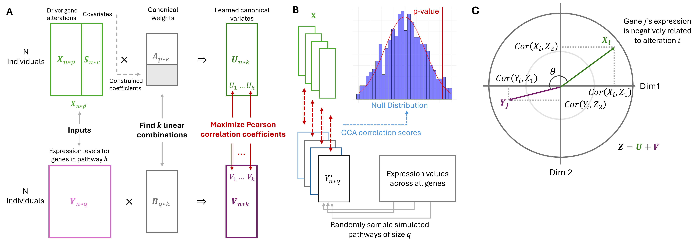

# PathwayCCA
PathwayCCA is a framework for pathway-level association analysis between multi-omic driver alterations and gene-set expression programs. We propose this framework that extends regularized Canonical Correlation Analysis (RCCA) and tests whether multiple somatic alterations jointly affect the expression of a given pathway. To address confounding from categorical covariates, we introduce an extension of CCA that supports arbitrary linear equality constraints, thereby enabling control over covariate contributions and preventing variables such as cancer subtypes from dominating. We further develop a novel sampling-based hypothesis test that mitigates the effect of spurious correlations common in high-dimensional data. 

  

The repository provides a complete implementation of Regularized CCA (RCCA), Constrained CCA (CCCA), and the proposed PathwayCCA framework with resampling-based hypothesis test. 

